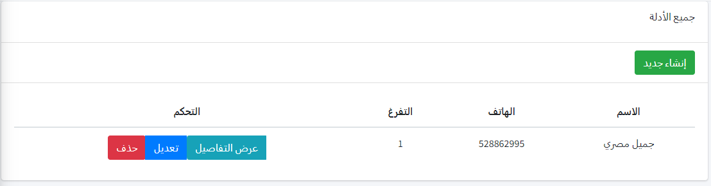
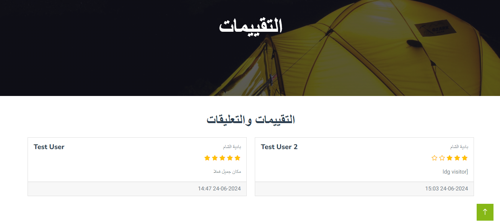
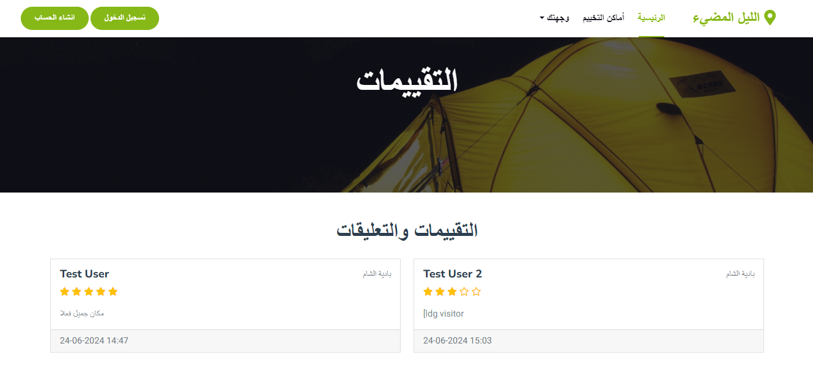
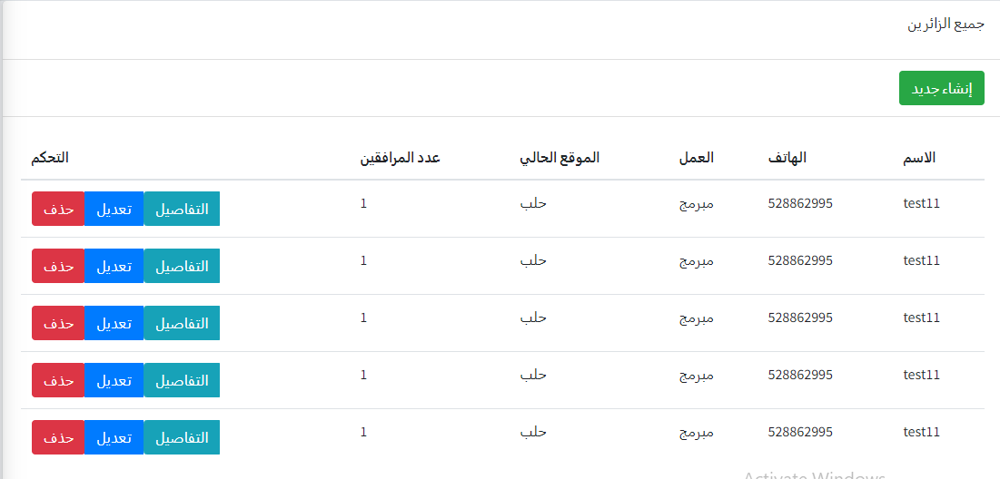

### Eng Hasan Hajjar   - 2024 projects
### المهندس حسن حجار
### للاستشارات البرمجية التواصل على الرقم عبر الواتس آب
###   +963933912076

لوحة التحكم.

لوحة التحكم للمدير.

لوحة التحكم الخاصة بالزائر.

لوحة التحكم الخاصة (الواجهة الرئيسية ) بالمدير.

الأدلة.

rating.

register arab.

أثناء الحذف يتم ارسال رسالة هل متأكد من الحذف .

أماكن التخييم في الموقع.

إضافة طبيب.

استكمال المعلومات 1.

استكمال المعلومات الزائر.

استكمال المعلومات بتصميم جديد .

اضافة حجز.

اظهار كل العأماكن داخل الموقع.

الأدلة السياحيين التعديل .

الأدلة.

الأماكن من طرف الزائر.

التفاصيل للأماكن بالعربي.

التفاصيل لمعلومات عن الطبيب.

التفاصيل لمكان التخييم.

التقييم للموقع.

التقييمات.

الزائرين.

الغابات فلترة.

المجموعات التي يمكن حجزها.

الواجهة الرئيسية للوحة التحكم للمدير.

الواجهة الرئيسية.

انشاء أماكن للتخييم.

انشاء الأماكن.

انشاء دليل سياحي.

انشاء مجموعة الرحلة.

انشاء معلومات الزائر.

تسجيل الدخول عربي.

تسجيل الدخول.

تعديل الطبيب.

تعديل المعلومات الزائر .

تعديل المكان .

تعديل معلومات الزائر.

تغيير لون الخلفية .

تعديل معلومات الطبيب.

تفاصيل الزائر.

تفاصيل الطبيب.

تفاصيل المعلومات بعد الاستكمال ومراجعتها.

تفاصيل الموقع في الموقع.

تقييم الموقع التخييم أثناء عرض التفاصيل.

جميع االأطباء.

جميع الأطباء بالعربي.

جميع الأماكن .

رسالة أنه لايمكن التقييم أكثر من مرة للمستخدم الواحد.

فلترة الصحراء داخل الموقع.

كمالة ادخال معلوامت المكان 2.

كمالة التعديل.

واجهة المجموعات.

واجهة الحجز في الصفحة الرئيسية.

نظام حجز انشاء.

## About Laravel

Laravel is a web application framework with expressive, elegant syntax. We believe development must be an enjoyable and creative experience to be truly fulfilling. Laravel takes the pain out of development by easing common tasks used in many web projects, such as:

- [Simple, fast routing engine](https://laravel.com/docs/routing).
- [Powerful dependency injection container](https://laravel.com/docs/container).
- Multiple back-ends for [session](https://laravel.com/docs/session) and [cache](https://laravel.com/docs/cache) storage.
- Expressive, intuitive [database ORM](https://laravel.com/docs/eloquent).
- Database agnostic [schema migrations](https://laravel.com/docs/migrations).
- [Robust background job processing](https://laravel.com/docs/queues).
- [Real-time event broadcasting](https://laravel.com/docs/broadcasting).

Laravel is accessible, powerful, and provides tools required for large, robust applications.

## Learning Laravel

Laravel has the most extensive and thorough [documentation](https://laravel.com/docs) and video tutorial library of all modern web application frameworks, making it a breeze to get started with the framework.

You may also try the [Laravel Bootcamp](https://bootcamp.laravel.com), where you will be guided through building a modern Laravel application from scratch.

If you don't feel like reading, [Laracasts](https://laracasts.com) can help. Laracasts contains thousands of video tutorials on a range of topics including Laravel, modern PHP, unit testing, and JavaScript. Boost your skills by digging into our comprehensive video library.

## Laravel Sponsors

We would like to extend our thanks to the following sponsors for funding Laravel development. If you are interested in becoming a sponsor, please visit the [Laravel Partners program](https://partners.laravel.com).

### Premium Partners

- **[Vehikl](https://vehikl.com/)**
- **[Tighten Co.](https://tighten.co)**
- **[WebReinvent](https://webreinvent.com/)**
- **[Kirschbaum Development Group](https://kirschbaumdevelopment.com)**
- **[64 Robots](https://64robots.com)**
- **[Curotec](https://www.curotec.com/services/technologies/laravel/)**
- **[Cyber-Duck](https://cyber-duck.co.uk)**
- **[DevSquad](https://devsquad.com/hire-laravel-developers)**
- **[Jump24](https://jump24.co.uk)**
- **[Redberry](https://redberry.international/laravel/)**
- **[Active Logic](https://activelogic.com)**
- **[byte5](https://byte5.de)**
- **[OP.GG](https://op.gg)**

## Contributing

Thank you for considering contributing to the Laravel framework! The contribution guide can be found in the [Laravel documentation](https://laravel.com/docs/contributions).

## Code of Conduct

In order to ensure that the Laravel community is welcoming to all, please review and abide by the [Code of Conduct](https://laravel.com/docs/contributions#code-of-conduct).

## Security Vulnerabilities

If you discover a security vulnerability within Laravel, please send an e-mail to Taylor Otwell via [taylor@laravel.com](mailto:taylor@laravel.com). All security vulnerabilities will be promptly addressed.

## License

The Laravel framework is open-sourced software licensed under the [MIT license](https://opensource.org/licenses/MIT).
